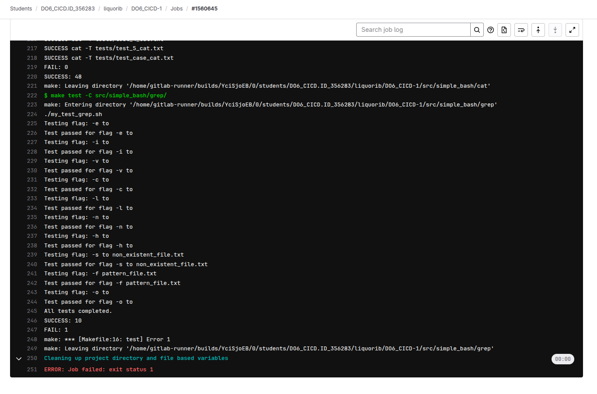

## Basic CI/CD

## Part 1. Настройка gitlab-runner

- Поднял виртуалку из задания 1.

- curl -L "https://packages.gitlab.com/install/repositories/runner/gitlab-runner/script.deb.sh" | sudo bash
- sudo apt install gitlab-runner
- apt-cache madison gitlab-runner
- sudo apt install gitlab-runner=17.2.0-1

- Ввел данные от проекта, ссылку: https://repos.21-school.ru, токен регистрации.
- Тэги: build,style,test,deploy,notify
- executor - shell
- Командами проверяем работу раннера:

## Part 2. Сборка

- Для мейкфайла, gcc и прочего:
- sudo apt-get install build-essential
- Перенесем src проекта simple bash в нынешний src и переименуем
- Напишем этап для сборки:

## Part 3. Тест кодстайла
- Для задания нужна команда снизу
- clang-format -style=Google --Werror -n
- стиль гугл, т.к. это единственное что есть в конфиге clang-format. --Werror используется чтобы зафейлить пайплайн в случае неправильного формата.

## Part 4. Интеграционные тесты
- Добавил условие что в этап юнит теста можно войти только при успешном прохождении предыдущих тестов.
- В каждый из тестов добавил exit в конце. Выход с кодом 1 - фейлит пайплайн.
- Захардкодил фейл для демонстрации:

## Part 5. Этап деплоя

- Соединил сети между собой через netplan

- через ssh я подключился к cicd2
- ssh -L 9999:localhost:22 10.10.0.3

- После установки соединения, я сделал тестовую передачу сообщения, в связи с которой я узнал что нужно выполнить команду:
- sudo chown liquorib /usr/local/bin
- чтобы программа выполнилась, иначе я не получаю разрешение

- чтобы не вводить пароль каждый раз, пришлось поставить свои ключи второй виртуалке
- sudo su gitlab-runner
- ssh-keygen -t rsa -b 2048
- ssh-copy-id liquorib@10.10.0.3
- ssh liquorib@10.10.0.3

- Далее, запускаем пайплайн:

